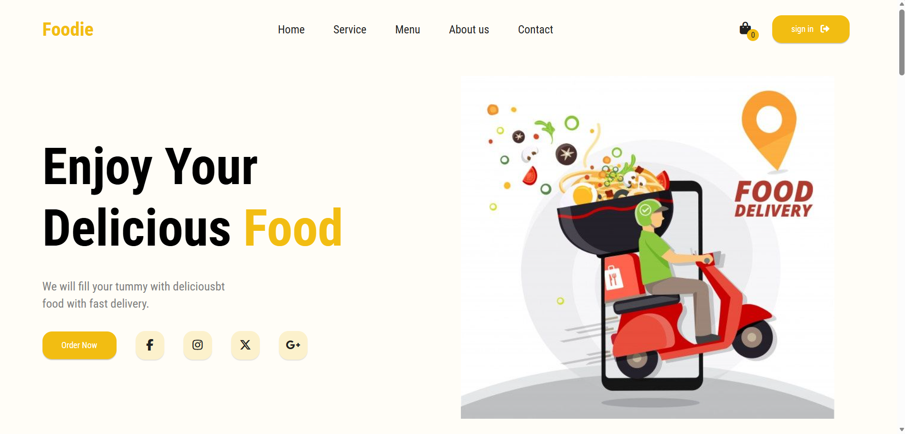

# 🍔 Foodie Web – Responsive Food Ordering Website

A modern and responsive Food Ordering Website built using HTML, CSS, and JavaScript. The project provides an attractive user interface where users can explore food items, add products to the cart, and enjoy a smooth browsing experience.

## 🚀 Live Demo

🔗 https://aks3591.github.io/Foodie-Web/

## 📌 Features

- 🍔 Responsive Design
- 🛒 Add to Cart Functionality
- ➕ Increase & Decrease Quantity
- 💰 Automatic Cart Total Calculation
- 📱 Mobile Friendly Navigation
- ⭐ Customer Reviews Slider
- 🍕 Dynamic Product Loading using JSON
- 🎨 Attractive UI Design

## 🛠️ Technologies Used

- HTML5
- CSS3
- JavaScript (ES6)
- JSON
- Swiper.js
- Font Awesome

## 📂 Project Structure

```
Foodie-Web/
│── index.html
│── style.css
│── main.js
│── products.json
│── images
```

## 📸 Screenshots



## 📖 How to Run

1. Clone the repository

```bash
git clone https://github.com/aks3591/Foodie-Web.git
```

2. Open the project folder

3. Open `index.html` in your browser

## 🎯 Future Improvements

- User Authentication
- Online Payment Integration
- Search Functionality
- Wishlist
- Order History
- Backend Integration
- Database Support

## 👨‍💻 Developer

**Ankit Kumar**

GitHub:
https://github.com/aks3591

---

⭐ If you like this project, don't forget to star the repository.
